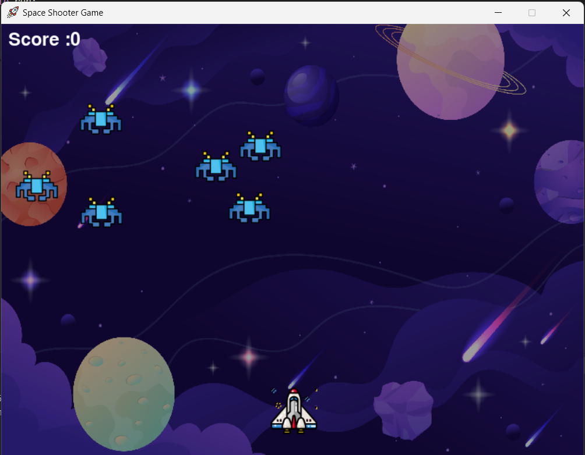
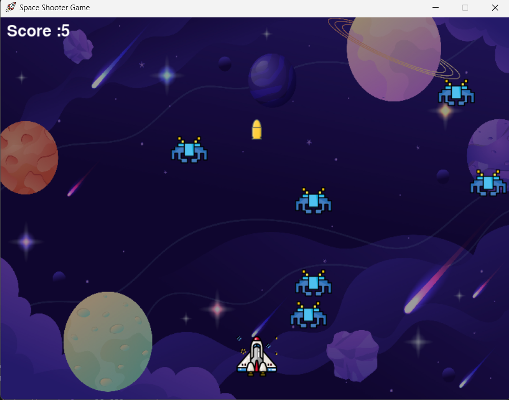
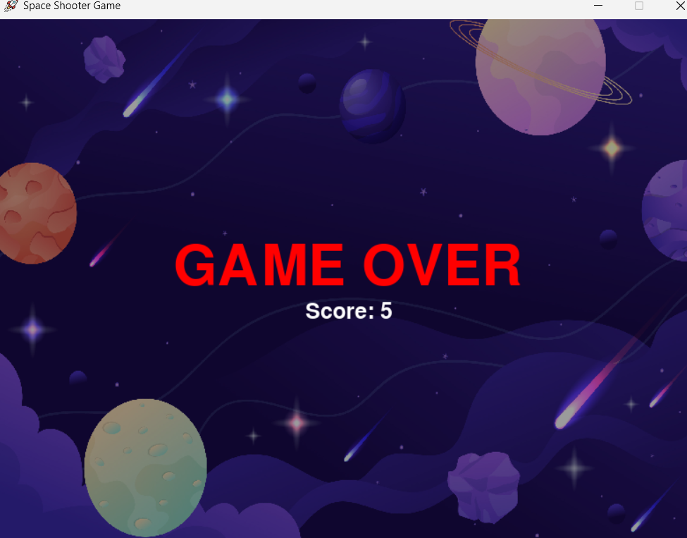

# 🛸 Space Invaders🚀
A simple Space Invaders-style arcade game built using Python and Pygame. Control a spaceship, shoot bullets, and destroy enemy invaders before they reach you. 

---
## 📸 Screenshots





---

## 🎮 Features

- 👾 Multiple enemy invaders with rando movement
- 🚀 Player-controlled spaceship (left/right movement)
- 💣 Bullet firing with collision detection
- 🔥 Score tracking
- 🌌 Background and sound ready (add your own)

---

## 🧰 Requirements
- Python 3.x
- Pygame

### Install dependencies:

```bash
pip install pygame
```

## 🛠️ How It Works
Uses a game loop to update game state and render graphics.
Enemy and player positions are updated every frame.
Bullet collisions are detected using distance-based collision detection.
When a bullet hits an enemy, the enemy resets to a new position and the score increases.
